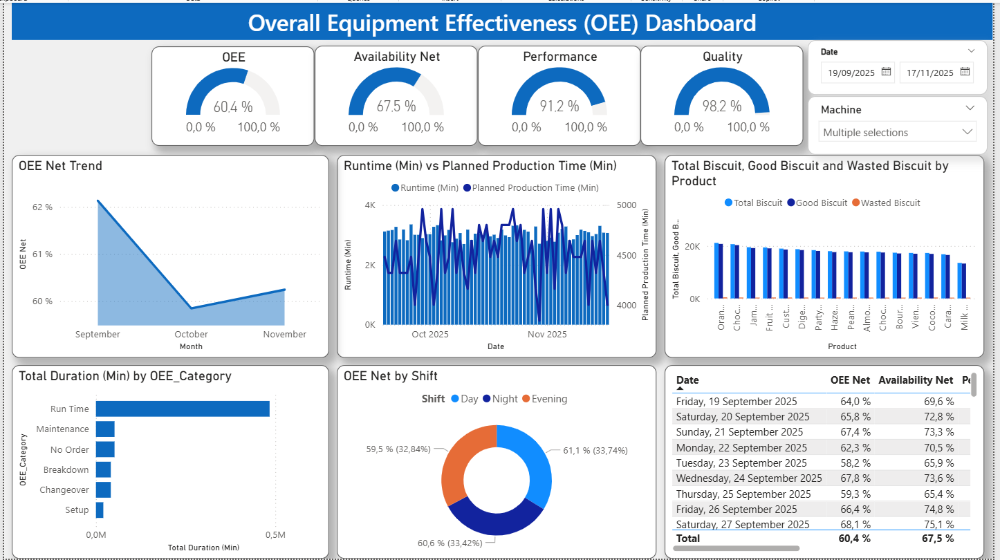
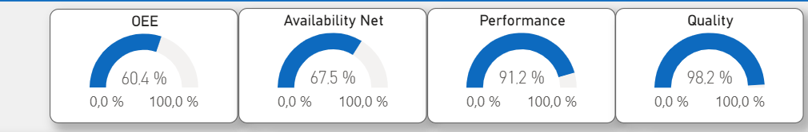
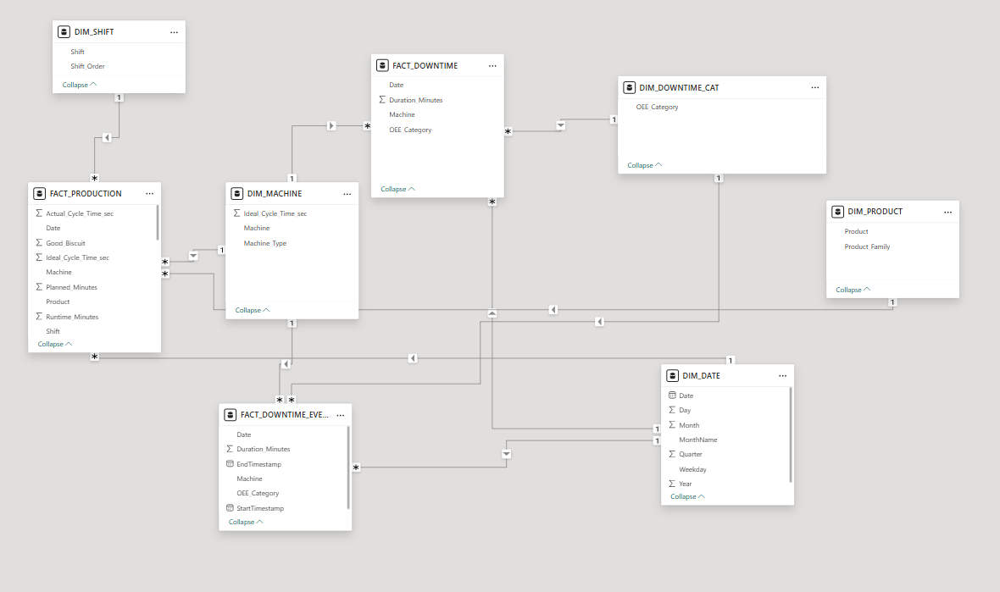
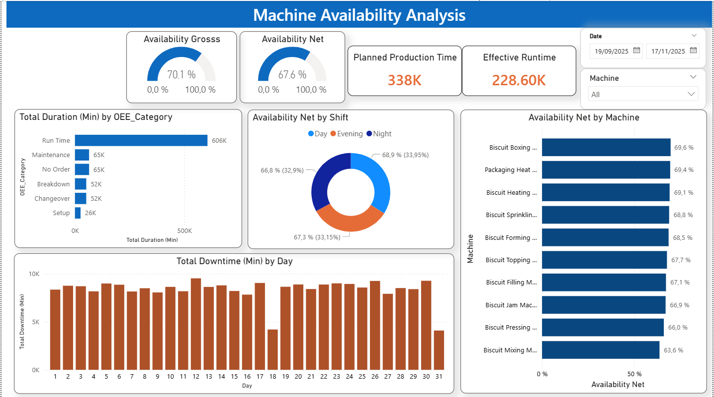
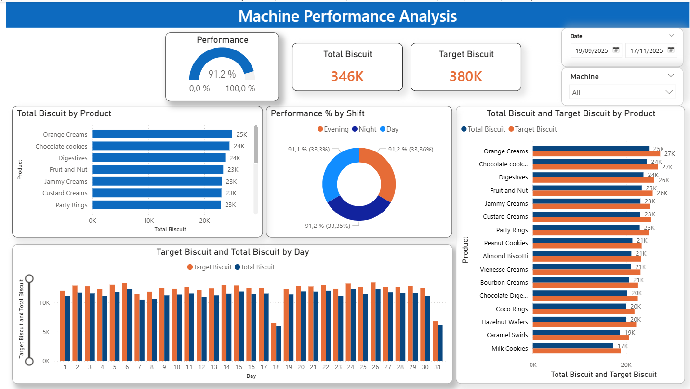

# OEE Manufacturing Dashboard

An interactive Power BI dashboard tracking Overall Equipment Effectiveness (OEE) 
across 10 production machines, delivering structured KPI reporting across 
availability, performance, and quality dimensions.

Developed as part of a Business Intelligence course at OTH Amberg-Weiden

## What It Measures

- **OEE** — overall equipment effectiveness
- **Availability** — actual run time vs planned production time
- **Performance** — actual output vs theoretical maximum output
- **Quality** — good units produced vs total units produced

## Technical Details

- Galaxy schema (fact constellation) with two fact tables — FACT_PRODUCTION 
  and FACT_DOWNTIME — sharing dimension tables DIM_MACHINE, DIM_DATE, 
  DIM_PRODUCT, and DIM_SHIFT
- Modeled 60 days of production data enabling scalable KPI calculation
- DAX measures for OEE, downtime minutes, output rates, and defect ratios
- Power Query ETL workflows for collecting, transforming, and validating 
  downtime logs, output counts, and defect records
- Full documentation of DAX logic, KPI definitions, and analytical workflows

## Tools Used

Power BI · DAX · Power Query · PostgreSQL

## Screenshots

## Author

Muhammad Hussain Sultan
